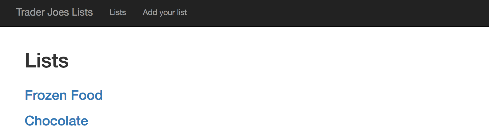
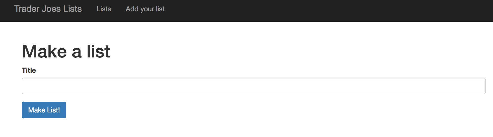
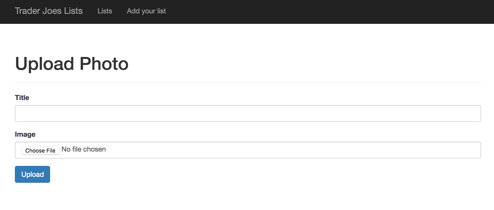
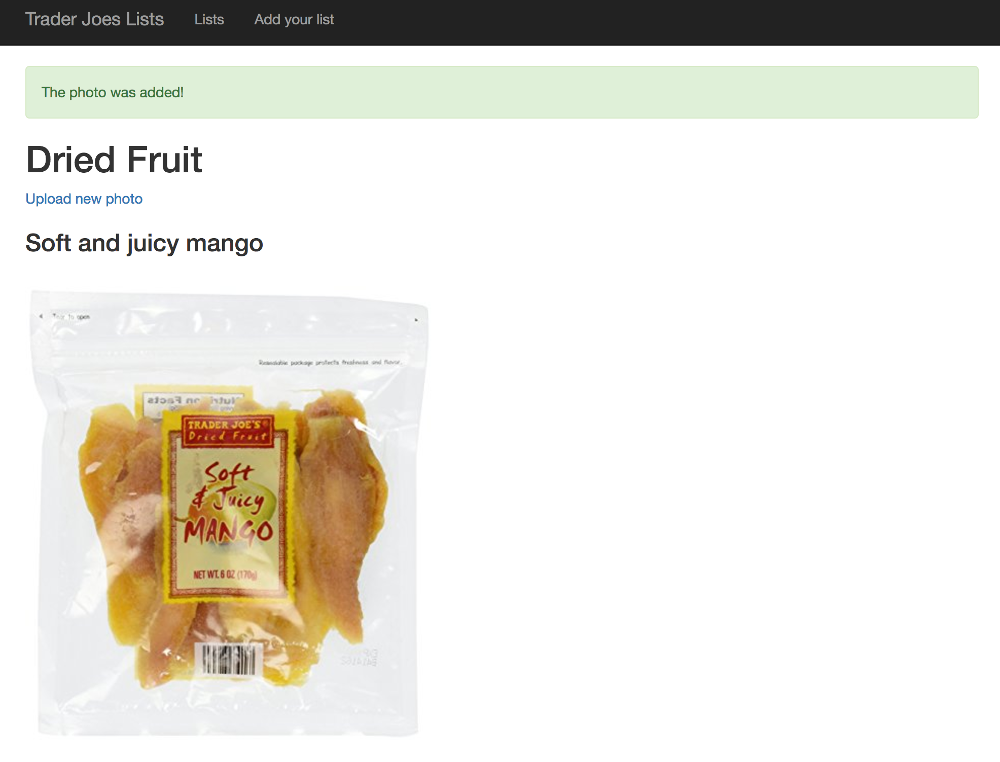
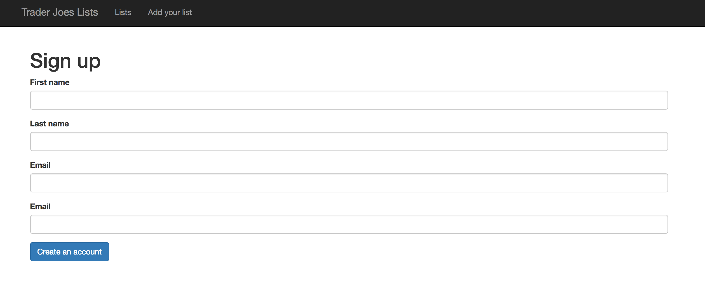
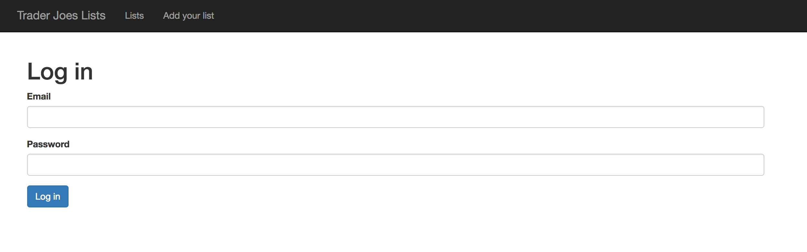

# Project Summary
This project is dedicated to Trader Joes fans. This page allows you to create lists of favorite products from Trader Joes. This way you can save and remember your favorite products and even see other user's lists.

# MVP

My desired MVP is a system that has users that are able to create lists and edit and delete items on the list. On the main page it will display all the lists of the users. Of course only the specific user can edit their lists.

My actual MVP is a system that allows you to create lists and add items to the list. The main page displays all the lists. 

# Functionality
I will run through the main flow of the website. 
## Main page
The main page displays all the lists that were made before. Clicking on the list takes you to that specific list.

## Make a list
You can make a list by clicking the 'Add your list' button on the top. The page allows you to choose the name of the list.

## Add images
After you make a list you will get a success message and redirected to the list page. Here you can add photos of items.

## List page with items
After you add an item you can see on that list page that you have that item now! Success!

# Architecture
I have two main pieces of architecter- lists and photos.
Lists are stored by their title and have a one to many relationship with photos. 

Photos are the many part of the relationship with lists. They are uploaded using the [gem paperclip](https://github.com/thoughtbot/paperclip). Due to this they have a few restrictions on the file type. In addition, they have a title and are stored with their title and url. 

# Key Issues
The main issue within the development of the application was the association between lists and photos. Making it work took me quite a long time. Currently I believe, the site is fully functional on its own and has known bugs. I think going to my desired MVP will also take time. I also have log in and sign up but since it wasn't integrated with the rest of my application, I have chosen to keep it hidden for now.

# References

"Adding Album Resource." Adding Album Resource – Makzan's Sharings. N.p., n.d. Web.

Bodrov-Krukowski, Ilya. "Uploading Files with Paperclip — SitePoint." 
SitePoint. SitePoint, 10 July 2015. Web.

"Learn Ruby on Rails." Codecademy. N.p., n.d. Web.

"Ruby on Rails: Authentication." Codecademy. N.p., n.d. Web.

Scotch. "File Upload in Rails with PaperClip." Scotch. N.p., n.d. Web.

